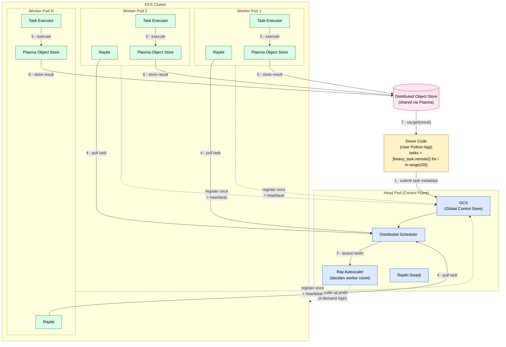

# Ray Deep Dive: Beginner → Expert

[Ray Documentation](https://docs.ray.io/en/latest/?utm_source=chatgpt.com)

This guide builds a complete mental model of Ray from fundamentals to advanced distributed systems design.

---


# Ray on EKS — Driver → Head Pod → Worker Pods

Mermaid diagram of the execution flow described in [head_worker_pods.md](./head_worker_pods.md).



## Key points

- **Driver → Head Pod**: sends task *metadata* only, not execution
- **Workers register once** with GCS (dashed lines) — no continuous polling
- **Workers PULL** tasks from the scheduler (not push from head)
- **Autoscaler** (inside head pod) decides when EKS spins up more worker pods
- **Object Store** is how results flow back to the driver, not through the head

## One-liner mental model

> Head = brain (schedule + state)
> Workers = muscles (execute tasks)
> Scheduler = nervous system (dispatch logic)
> Object store = memory (data exchange)


# 1. What Ray Actually Solves

Before Ray, scaling Python usually meant:

* `threading`
* `multiprocessing`
* Celery
* Spark
* Kubernetes orchestration
* manual RPC systems

Problems:

* Python GIL
* serialization overhead
* cluster management complexity
* hard fault tolerance
* distributed state management

Ray abstracts this away.

You write:

```python
@ray.remote
def work(x):
    return x * 2
```

Ray turns it into:

* distributed execution
* async scheduling
* fault-tolerant computation
* scalable execution graph

across:

* CPUs
* GPUs
* multiple machines

---

# 2. Ray Architecture (Critical Mental Model)

At high level:

```text
Driver Program
    |
    v
Ray Cluster
 ├── Head Node
 │    ├── Global Control Store (GCS)
 │    ├── Scheduler
 │    └── Object metadata
 │
 └── Worker Nodes
      ├── Worker Processes
      ├── Object Store (Plasma)
      └── Local Scheduler
```

---

# 3. The Three Fundamental Abstractions

Everything in Ray is built from:

| Concept    | Meaning                    |
| ---------- | -------------------------- |
| Tasks      | Stateless remote functions |
| Actors     | Stateful remote services   |
| ObjectRefs | Distributed futures        |

Master these and you understand Ray Core.

---

# 4. Installing and Running Ray

Install:

```bash
pip install ray
```

Start local Ray runtime:

```python
import ray
ray.init()
```

This launches:

* scheduler
* object store
* worker pool

Shutdown:

```python
ray.shutdown()
```

---

# 5. Tasks — Distributed Functions

## Normal Function

```python
def add(x, y):
    return x + y
```

## Ray Task

```python
@ray.remote
def add(x, y):
    return x + y
```

Execution:

```python
ref = add.remote(2, 3)
```

This does NOT return `5`.

It returns:

```python
ObjectRef(...)
```

Fetch result:

```python
result = ray.get(ref)
```

---

# 6. Understanding ObjectRefs Deeply

This is the MOST IMPORTANT beginner concept.

## Traditional Python

```python
x = add(2, 3)
```

Blocks immediately.

---

## Ray

```python
ref = add.remote(2, 3)
```

Returns immediately.

Execution happens elsewhere.

The result may:

* run on another process
* another machine
* another GPU node

The `ObjectRef` is a distributed pointer.

---

# 7. Parallelism in Ray

## Sequential

```python
results = []

for i in range(10):
    results.append(add(i, i))
```

Slow.

---

## Parallel Ray Version

```python
refs = [add.remote(i, i) for i in range(10)]
results = ray.get(refs)
```

All tasks execute concurrently.

This is Ray’s core power.

---

# 8. Task Dependency Graphs

Ray automatically builds DAGs.

Example:

```python
@ray.remote
def step1(x):
    return x + 1

@ray.remote
def step2(y):
    return y * 2

a = step1.remote(10)
b = step2.remote(a)

print(ray.get(b))
```

You passed `ObjectRef` directly.

Ray:

* understands dependency graph
* schedules correctly
* transfers data automatically

---

# 9. Actors — Stateful Distributed Objects

Tasks are stateless.

Actors persist state.

---

## Actor Example

```python
@ray.remote
class Counter:
    def __init__(self):
        self.count = 0

    def increment(self):
        self.count += 1
        return self.count
```

Create actor:

```python
counter = Counter.remote()
```

Call methods:

```python
ray.get(counter.increment.remote())
```

---

# 10. Why Actors Matter

Actors power:

* LLM serving
* chat sessions
* parameter servers
* distributed caches
* game servers
* streaming systems

Actors are basically:

> distributed microservices in Python

---

# 11. Task vs Actor

| Feature            | Task       | Actor            |
| ------------------ | ---------- | ---------------- |
| Stateful           | No         | Yes              |
| Fast startup       | Yes        | Slower           |
| Mutable state      | No         | Yes              |
| Parallel execution | Massive    | Limited by actor |
| Use case           | Batch work | Services         |

---

# 12. Ray Object Store (Plasma)

One of Ray’s most important innovations.

Large objects are stored in:

* shared memory
* distributed memory pool

instead of copied repeatedly.

---

## Why This Matters

Without Ray:

```python
process -> serialize -> socket -> deserialize
```

Huge overhead.

Ray:

* zero-copy reads
* shared memory transport
* optimized serialization

critical for:

* tensors
* pandas
* numpy arrays
* ML workloads

---

# 13. Serialization in Ray

Ray uses:

* cloudpickle
* Arrow serialization
* Plasma object store

Good for:

* numpy arrays
* ML tensors
* pandas
* Python objects

Bad for:

* open DB connections
* thread locks
* OS handles

---

# 14. Resource Scheduling

Ray scheduler manages:

* CPUs
* GPUs
* custom resources
* memory constraints

---

## CPU Example

```python
@ray.remote(num_cpus=2)
def train():
    ...
```

---

## GPU Example

```python
@ray.remote(num_gpus=1)
def inference():
    ...
```

---

# 15. Placement Groups

Advanced scheduling.

Guarantees:

* co-location
* gang scheduling
* distributed training layout

Used heavily in:

* PyTorch distributed
* LLM serving

---

# 16. Async Execution

Ray supports asyncio-style actors.

Example:

```python
@ray.remote
class AsyncWorker:
    async def work(self):
        return 1
```

Important for:

* high-throughput APIs
* streaming inference
* networking

---

# 17. Fault Tolerance

Ray automatically handles:

* worker crashes
* node failures
* task retries

Example:

```python
@ray.remote(max_retries=3)
def unstable():
    ...
```

---

# 18. Distributed Scheduling Internals

Ray uses hierarchical scheduling.

## Local Scheduler

Fast scheduling on node.

## Global Scheduler

Coordinates cluster-wide resources.

This minimizes central bottlenecks.

---

# 19. Backpressure & Scaling

Bad Ray code can create:

* millions of pending tasks
* memory explosions
* scheduler overload

---

## Anti-pattern

```python
refs = [task.remote(i) for i in range(10_000_000)]
```

---

## Better

Use batching:

```python
BATCH = 1000

for chunk in chunks(data, BATCH):
    refs = [task.remote(x) for x in chunk]
    ray.get(refs)
```

---

# 20. Ray Data

Distributed dataframe + pipeline system.

```python
import ray.data as rd

ds = rd.read_csv("s3://bucket/data")
```

Supports:

* map
* filter
* batch inference
* streaming pipelines

---

# 21. Ray Train

Distributed ML training abstraction.

Supports:

* PyTorch
* TensorFlow
* Horovod
* DeepSpeed

Example:

```python
from ray.train.torch import TorchTrainer
```

Handles:

* distributed workers
* checkpoints
* elastic training

---

# 22. Ray Tune

Hyperparameter optimization.

```python
from ray import tune
```

Supports:

* grid search
* Bayesian optimization
* ASHA
* Population Based Training

---

# 23. Ray Serve

Production model serving framework.

Core concepts:

* deployments
* replicas
* autoscaling
* batching
* routing

---

## Serve Example

```python
from ray import serve

@serve.deployment
class Model:
    def __call__(self, request):
        return "hello"
```

---

# 24. LLM Serving with Ray

Ray is heavily used for:

* vLLM clusters
* multi-GPU inference
* distributed KV cache
* batching/token scheduling

Common stack:

```text
Ray + vLLM + Serve + Kubernetes
```

---

# 25. Ray DAG Execution

Ray internally builds execution graphs.

```text
Task A
  |
Task B
  |
Task C
```

Ray tracks:

* dependencies
* lineage
* recovery state

---

# 26. Lineage-Based Recovery

If node fails:

* Ray reconstructs objects
* replays lineage graph
* reruns upstream tasks

This is a key distributed systems concept.

---

# 27. Advanced Actor Patterns

## Actor Pool

```python
workers = [Worker.remote() for _ in range(8)]
```

Load balance manually.

---

## Supervisor Actor

One actor manages others.

Used for:

* orchestration
* monitoring
* routing

---

## Pipeline Actors

Streaming architecture.

---

# 28. Performance Optimization

## Avoid Tiny Tasks

Bad:

```python
@ray.remote
def add1(x):
    return x + 1
```

called millions of times.

Scheduling overhead dominates.

---

## Prefer Coarse Tasks

Better:

* 100ms+
* batch processing
* vectorized operations

---

# 29. Memory Management

Ray memory types:

| Memory              | Purpose        |
| ------------------- | -------------- |
| Heap memory         | Python process |
| Object store memory | Shared objects |
| Spill storage       | Disk overflow  |

Monitor carefully.

---

# 30. Common Ray Anti-Patterns

## Calling `ray.get()` too early

Bad:

```python
results = []

for i in range(100):
    results.append(ray.get(task.remote(i)))
```

Sequentializes work.

---

## Better

```python
refs = [task.remote(i) for i in range(100)]
results = ray.get(refs)
```

---

# 31. Ray on Kubernetes

Common production deployment.

Using:

* KubeRay
* autoscaling
* GPU scheduling

Architecture:

```text
Kubernetes
   |
KubeRay Operator
   |
Ray Cluster
```

---

# 32. Ray vs Spark

| Ray                         | Spark                   |
| --------------------------- | ----------------------- |
| General distributed compute | Data processing focused |
| Python-native               | JVM-centric             |
| Fine-grained tasks          | Batch DAGs              |
| ML/AI optimized             | ETL optimized           |
| Low latency                 | Higher latency          |

---

# 33. Ray vs Dask

| Ray                                | Dask                  |
| ---------------------------------- | --------------------- |
| Actor model                        | Mostly task graph     |
| Better ML serving                  | Better pandas scaling |
| Stronger distributed systems layer | Simpler analytics     |
| More ecosystem tools               | Lightweight           |

---

# 34. Ray Internals Experts Should Know

Key components:

| Component | Role                |
| --------- | ------------------- |
| GCS       | Cluster metadata    |
| Plasma    | Shared object store |
| Raylet    | Node manager        |
| Worker    | Executes Python     |
| Scheduler | Task placement      |

---

# 35. Scaling Philosophy

Ray is optimized for:

* dynamic workloads
* AI systems
* heterogeneous compute
* mixed task/actor execution

Not just batch jobs.

---

# 36. Real-World Production Patterns

## ML Training

```text
Ray Train
  -> distributed GPUs
```

---

## Batch Inference

```text
Ray Data
  -> map_batches()
```

---

## Online Serving

```text
Ray Serve
  -> autoscaled replicas
```

---

## Agent Systems

```text
Actors = long-lived AI agents
Tasks = subtasks
```

---

# 37. Distributed Systems Concepts Behind Ray

Ray teaches:

* futures/promises
* DAG execution
* distributed scheduling
* lineage recovery
* shared-memory IPC
* actor systems
* backpressure
* resource-aware scheduling

---

# 38. Expert-Level Topics

Advanced users study:

* object spilling
* placement group strategies
* actor checkpointing
* async actors
* zero-copy tensor transport
* GPU affinity
* autoscaler internals
* Kubernetes integration
* distributed debugging

---

# 39. Production Challenges

Common issues:

* object store OOM
* task explosion
* serialization bottlenecks
* network saturation
* GPU fragmentation

---

# 40. Best Way to Learn Ray

## Beginner

* tasks
* actors
* ray.get()
* parallelism

---

## Intermediate

* object store
* scheduling
* fault tolerance
* async actors

---

## Advanced

* Serve
* Train
* placement groups
* Kubernetes
* performance tuning

---

# 41. Recommended Learning Resources

* [Ray Core docs](https://docs.ray.io/en/latest/ray-core/?utm_source=chatgpt.com)
* [Ray architecture guide](https://docs.ray.io/en/latest/ray-core/key-concepts.html?utm_source=chatgpt.com)
* [Ray Serve docs](https://docs.ray.io/en/latest/serve/?utm_source=chatgpt.com)
* [Ray Train docs](https://docs.ray.io/en/latest/train/?utm_source=chatgpt.com)
* [KubeRay docs](https://docs.ray.io/en/latest/cluster/kubernetes/?utm_source=chatgpt.com)

---

# Final Mental Model

Ray is:

> A distributed operating system for Python workloads.

You provide:

* Python code
* resource requirements
* dependencies

Ray handles:

* scheduling
* parallelism
* state
* recovery
* scaling
* distributed execution

---

# The Single Most Important Insight

Ray is NOT just:

> “parallel Python”

Ray is actually:

```text
Distributed execution graphs
+ distributed shared memory
+ actor-based services
+ intelligent scheduling
```

wrapped in Python APIs.


Great — now you’re at the **real production-level Ray thinking stage**, so I’ll explain this properly.

---

# ✅ 1. What you now have working

You said:

> [http://127.0.0.1:8265/#/serve](http://127.0.0.1:8265/#/serve) is running fine

That means:

* Ray **head node is running**
* Dashboard is active
* Serve system is enabled
* You are currently in **local cluster mode**

---

# 👀 2. How to see workers in real time

Go to:

### 👉 Ray Dashboard

[http://127.0.0.1:8265](http://127.0.0.1:8265)

Then check:

## 📌 “Cluster” tab

You will see:

* Nodes
* CPUs
* Memory
* GPU usage

---

## 📌 “Workers” view (important)

You can inspect:

* active worker processes
* task execution
* resource usage

---

## 📌 “Tasks” tab

Shows:

* running tasks
* completed tasks
* retries
* failures

---

## 📌 “Serve” tab (you already opened)

Shows:

* deployments
* replicas
* traffic
* latency
* autoscaling

---

# 🔥 3. How to run jobs and SEE workers live

You need to generate **real distributed tasks**, not just local Python calls.

---

## Example 1: See workers spawning

```python
import ray
import time

ray.init(address="auto")

@ray.remote
def heavy_task(x):
    time.sleep(10)
    return x * x

tasks = [heavy_task.remote(i) for i in range(20)]

print(ray.get(tasks))
```

### What you will see in dashboard:

* multiple workers created
* tasks distributed
* CPU usage spike
* task timeline view fills up

---

## Example 2: Actor-based workers (best for visualization)

```python
import ray
import time

ray.init(address="auto")

@ray.remote
class Worker:
    def process(self, x):
        time.sleep(5)
        return x + 1

workers = [Worker.remote() for _ in range(4)]

results = []
for i in range(20):
    results.append(workers[i % 4].process.remote(i))

print(ray.get(results))
```

### You will see:

* 4 persistent workers
* task routing between them
* long-lived actor lifecycle in dashboard

---

# 🧠 4. Important concept (what “workers” really are)

In Ray:

| Term   | Meaning                          |
| ------ | -------------------------------- |
| Worker | Python process executing tasks   |
| Task   | function execution unit          |
| Actor  | stateful worker                  |
| Node   | machine (your laptop or cluster) |

So “seeing workers” = seeing Python processes managed by Ray.

---

# 🚀 5. Your bigger question: EKS / ECS architecture

You asked:

> does head run every time in EKS pod or ECS task?

### Answer: YES — BUT in a controlled architecture

---

# 🧩 6. Production Ray architecture (EKS / ECS)

## Typical setup:

### 🟡 Head node (1 pod / task)

Runs:

* GCS (cluster state)
* scheduler
* dashboard (optional)
* serve controller

👉 MUST always be running

---

### 🔵 Worker nodes (many pods / tasks)

Runs:

* task execution
* actors
* model inference
* data processing

👉 autoscaled up/down

---

# 📦 7. On EKS (Kubernetes) — BEST PRACTICE

You use:

👉 **KubeRay Operator**

Architecture:

```text
EKS Cluster
   |
   ├── Ray Head Pod (always ON)
   ├── Worker Pods (autoscale)
   └── Ray Service / Serve
```

---

### Head node in EKS:

* runs as a **Deployment (1 replica)**
* never scales to zero
* acts as cluster brain

---

### Worker nodes:

* Kubernetes autoscaler creates/removes pods
* Ray autoscaler requests more pods

---

# 📦 8. On ECS (AWS)

You do:

### Head = ECS Service (desired count = 1)

### Workers = ECS tasks (dynamic scaling)

BUT:

* ECS is less common for Ray than EKS
* missing native autoscaler integration

---

# ⚠️ 9. Key rule (VERY important)

> If head node dies → entire Ray cluster is gone

So:

| Component | Must be running? |
| --------- | ---------------- |
| Head node | YES              |
| Workers   | optional         |
| Dashboard | optional         |

---

# 📊 10. How to make your dashboard “feel real-time”

Run workloads like:

### Continuous load generator:

```python
while True:
    tasks = [heavy_task.remote(i) for i in range(50)]
    ray.get(tasks)
```

Then dashboard becomes:

* live CPU graphs
* worker churn visualization
* task streaming view

---

# 🧠 11. What you should focus on next

Since you already have dashboard working:

## Next level skills:

### 🔹 1. Actor pools (production pattern)

### 🔹 2. Ray Serve deployments (real APIs)

### 🔹 3. Autoscaling worker nodes

### 🔹 4. Kubernetes Ray (KubeRay)

### 🔹 5. GPU scheduling for ML workloads

---

# 🚀 If you want next step (recommended)

I can show you:

### 👉 “Real production Ray system design”

* EKS head + worker setup YAML
* autoscaling config
* Serve deployment (LLM API)
* live worker visualization patterns
* debugging Ray clusters like Netflix/Airbnb systems

Just tell me 👍


Good — you’re now asking exactly the **right “distributed systems thinking” questions**. Let’s make this crystal clear.

---

# 1. Tasks vs Actors (when to use what)

This is the most important Ray design decision.

---

## ✅ A) Use **Tasks (@ray.remote function)** when:

Think: **“stateless, parallel work”**

### Use cases:

* batch processing
* map-style workloads
* ETL pipelines
* image processing
* ML inference batches
* one-off computations

### Example:

```python
@ray.remote
def heavy_task(x):
    return x * x
```

### Why tasks?

* no memory/state
* highly parallel
* easy to scale
* cheapest scheduling overhead

👉 Best mental model:

> “run this function anywhere, I don’t care where”

---

## ✅ B) Use **Actors (@ray.remote class)** when:

Think: **“a running service with memory”**

### Use cases:

* model loaded in memory (LLM, PyTorch)
* counters / caches
* streaming pipelines
* game simulation state
* database-like services
* session-based logic

### Example:

```python
@ray.remote
class Worker:
    def __init__(self):
        self.count = 0

    def add(self, x):
        self.count += x
        return self.count
```

### Why actors?

* state persists across calls
* avoid reloading models repeatedly
* reduce overhead
* behave like microservices

👉 Best mental model:

> “this is a long-running worker process”

---

## ⚖️ Simple rule

| Type  | Use it when                   |
| ----- | ----------------------------- |
| Task  | “do work and forget”          |
| Actor | “keep memory and reuse state” |

---

# 2. Is your local Ray Dashboard the “Head POD”?

You asked:

> is [http://127.0.0.1:8265](http://127.0.0.1:8265) the head POD?

### ✅ YES — BUT locally

In your local setup:

```text
Your laptop = entire Ray cluster
```

So:

| Component        | Local machine                |
| ---------------- | ---------------------------- |
| Head node        | YES (same machine)           |
| Worker nodes     | YES (same machine processes) |
| Dashboard (8265) | YES (part of head)           |

👉 So locally:

> You are running a **single-node cluster**

---

# 3. What happens in EKS (important architecture)

Now your mental model for production:

## 🧠 EKS Ray cluster looks like:

```text
Kubernetes Cluster
│
├── Ray Head Pod (1 pod)
│     ├── GCS
│     ├── Scheduler
│     └── Dashboard (8265 optional)
│
└── Ray Worker Pods (many pods)
      ├── execute tasks
      ├── run actors
      └── scale dynamically
```

---

## 🔥 Key point:

> Dashboard ALWAYS lives with the HEAD pod

So:

* `8265` = head pod UI
* NOT worker pod UI

---

# 4. Your confusion (very common)

You said:

> “one worker pod running but reference should see in head pod only”

### ✅ YES — and that’s correct

Because:

## Flow:

```text
Python code → Head Pod → schedules task → Worker Pod executes
```

BUT:

### Important insight:

👉 Head node DOES NOT execute your code

It only:

* schedules tasks
* tracks state
* stores metadata
* shows dashboard UI

---

# 5. What actually happens in your example

```python
ray.init(address="auto")

@ray.remote
def heavy_task(x):
    time.sleep(10)
    return x * x

tasks = [heavy_task.remote(i) for i in 20]
```

---

## Step-by-step execution:

### 1. Driver (your script)

* sends tasks to Ray

### 2. Head Pod

* receives task requests
* puts tasks into scheduler

### 3. Worker Pods

* pick tasks
* execute `heavy_task`
* return results

### 4. Object Store

* stores results

### 5. Dashboard (8265)

* shows:

  * task timeline
  * worker usage
  * CPU graphs

---

# 6. VERY IMPORTANT MISUNDERSTANDING FIX

You wrote:

> “one worker pod running that should be visible in head pod”

### ⚠️ Correction:

Head pod does NOT “run workers”

Instead:

| Component  | Role                     |
| ---------- | ------------------------ |
| Head pod   | controls everything      |
| Worker pod | executes code            |
| Dashboard  | visualizes cluster state |

👉 Head does NOT “contain worker reference”
👉 It only TRACKS workers

---

# 7. When should you use Actors in EKS?

In production:

## Use Actors for:

### 🔥 ML inference servers

```python
@ray.remote(num_gpus=1)
class LLMServer:
    def __init__(self):
        self.model = load_model()
```

### 🔥 Stateful services

* user session
* recommendation engine
* streaming aggregation

---

## Use Tasks for:

* batch inference
* ETL jobs
* preprocessing
* distributed compute

---

# 8. Real-world design pattern (VERY IMPORTANT)

## LLM inference system:

```text
Serve Deployment (Actor)
    ↓
multiple replicas (actors)
    ↓
tasks inside actors or batch requests
```

---

# 9. Mental model that makes Ray “click”

## Think like this:

### Head pod = “brain”

* plans everything
* tracks state
* schedules work

### Worker pods = “hands”

* execute tasks
* do computation

### Actors = “always-on workers with memory”

### Tasks = “one-time jobs”

---

# 10. Final summary

## 🟢 Use Tasks when:

* parallel jobs
* stateless compute
* batch processing

## 🔵 Use Actors when:

* need memory/state
* long-running service
* model loaded once

---

## 🧠 In EKS:

| Component        | Exists where |
| ---------------- | ------------ |
| Head pod         | 1 pod        |
| Worker pods      | many pods    |
| Dashboard (8265) | head pod     |
| Task execution   | worker pods  |

---

# If you want next level (recommended)

I can show you:

* 🔥 full EKS Ray YAML (head + autoscaling workers)
* 🚀 Ray Serve LLM architecture (production-grade)
* ⚙️ how autoscaler decides worker pods
* 🧠 how tasks are queued internally (GCS + raylet deep dive)

Just tell me 👍
