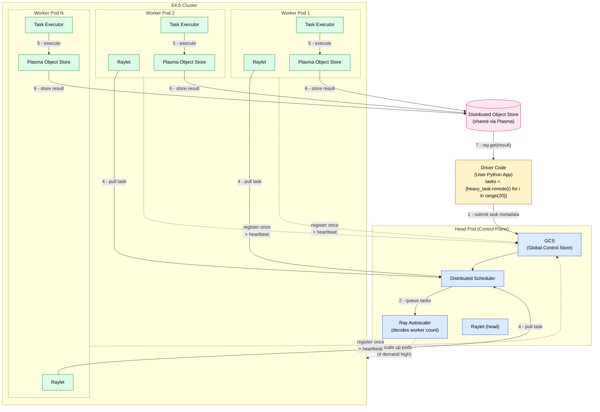

# Ray on EKS — Driver → Head Pod → Worker Pods

Mermaid diagram of the execution flow described in [head_worker_pods.md](./head_worker_pods.md).

## Key points

- **Driver → Head Pod**: sends task *metadata* only, not execution
- **Workers register once** with GCS (dashed lines) — no continuous polling
- **Workers PULL** tasks from the scheduler (not push from head)
- **Autoscaler** (inside head pod) decides when EKS spins up more worker pods
- **Object Store** is how results flow back to the driver, not through the head

## One-liner mental model

> Head = brain (schedule + state)
> Workers = muscles (execute tasks)
> Scheduler = nervous system (dispatch logic)
> Object store = memory (data exchange)
